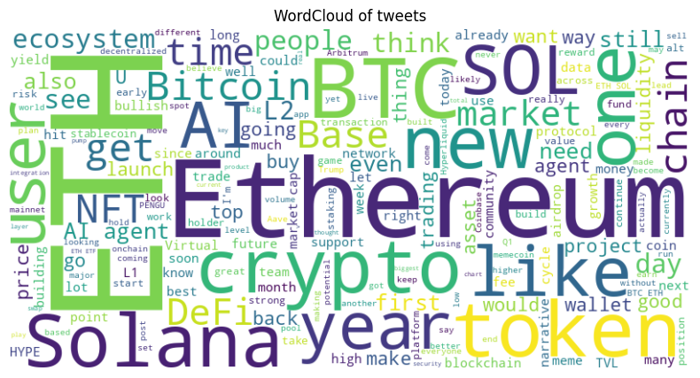
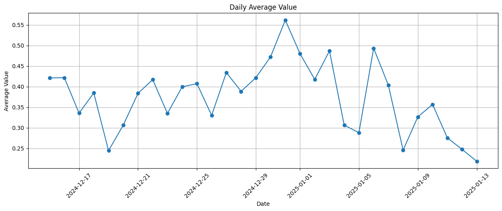

# Crypto-sentiment
A service for analysing sentiments of crypro-related tweets based on coins

## Project Overview 
This project develops a sentiment analysis system for Crypto Twitter (CT) to classify tweets into three categories: bearish (negative), neutral, and bullish (positive). Additionally, it computes a continuous sentiment score ranging from -1 (fully bearish) to 1 (fully bullish).

The system employs two primary approaches:

1. Fine-Tuning a BERT-Based Model: Utilizing the manually labeled dataset `tweets-train.csv`, the BERT-based model is fine-tuned to recognize the unique language prevalent in crypto discussions. This approach addresses challenges such as mixed sentiments within a single tweet and imbalanced data distributions.

2. Leveraging Large Language Models (LLMs) for Aspect-Based Sentiment Analysis: An alternative method involves using LLMs to generate structured outputs for aspect-based sentiment analysis. This technique extracts specific cryptocurrencies mentioned in tweets and determines the corresponding sentiment for each, providing a more granular understanding of market perceptions. 

Both approaches are accessible via a FastAPI interface, allowing for sentiment analysis on individual tweets or batch processing of multiple entries.

Furthermore, the system processes an unlabeled dataset of Ethereum tweets `ETH_data.csv` to calculate the daily average sentiment index. A time series plot is then generated to visualize sentiment trends over time, offering insights into the evolving market sentiment.


## EDA, Cleaning, and Augmentation

(Detailed analysis in `notebook/EDA_and_Cleaning.ipynb`)

### Feature Selection:
After reviewing the dataset, certain columns such as `is_crypto_tweet` and `account_id` (`time` for bert-based approach) were found to be unhelpful for sentiment analysis and were dropped. While author information isn’t available properly in this dataset, it might be useful in other projects.

Text Length Distribution:


### Cleaning:
The dataset contains various unusual characters that require normalization. However, emojis were preserved, as they play a significant role in sentiment expression. In the crypto context, emojis like 🔥, 🚀, and 📈 often carry specific meanings.

**Cleaning Steps Implemented:**
- **URL Replacement:** Since Twitter quotes URLs frequently, they were replaced.
- **Character Refinement:** Unusual characters were normalized while keeping emojis.
- **Whitespace Removal:** Extra spaces were removed.

Wordcloud of tweets dataset:


Wordcloud of ETH tweets dataset:




### Data Imbalance:
The dataset is highly imbalanced, with bearish tweets being underrepresented:

| Label  | Count |
|--------|------:|
| 1 (Neutral) | 1133 |
| 2 (Bullish) | 734  |
| 0 (Bearish) | 357  |


### Augmentation:
To address the class imbalance, a paraphrasing-based augmentation strategy was applied using **OpenAI's GPT-4o-mini**.

- **Neutral Class:** No augmentation was applied since it had the highest count.
- **Bullish Class:** Selected samples were paraphrased to increase diversity.
- **Bearish Class:** Each sample was paraphrased twice to boost representation.

To **prevent data leakage**, augmentation was applied only to the **training set**.

Post-Augmentation Dataset Balance:

| Label  | Count |
|--------|------:|
| 1 (Neutral) | 805 |
| 2 (Bullish) | 805 |
| 0 (Bearish) | 747 |

Now, the dataset is well-balanced, allowing the model to learn more effectively from all sentiment classes.


## Model Selection and Fine-Tuning

(Training process in `notebook/Training.ipynb`)

To accurately capture the unique language, idioms, and slang used in the crypto community, a domain-specific base model was essential. After evaluating multiple options, **ElKulako/cryptobert** was chosen. This model is already fine-tuned for sentiment analysis and is built on the **RobertaForSequenceClassification** architecture.

Below are the key configuration details:

```json
{
  "model_type": "roberta",
  "architectures": ["RobertaForSequenceClassification"],
  "hidden_size": 768,
  "num_hidden_layers": 12,
  "num_attention_heads": 12,
  "intermediate_size": 3072,
  "hidden_act": "gelu",
  "hidden_dropout_prob": 0.1,
  "attention_probs_dropout_prob": 0.1,
  "max_position_embeddings": 514,
  "vocab_size": 50265,
  "problem_type": "single_label_classification"
}
```

Due to the dataset's imbalance, accuracy alone wouldn’t be a reliable metric. Instead, **F1-score, precision, and recall** were monitored to ensure fair performance across all sentiment classes.

Training Results:

| Epoch | Training Loss | Validation Loss | Accuracy | Precision | Recall | F1 Score |
|-------|--------------|----------------|----------|-----------|--------|----------|
| 1     | No log       | 0.587156       | 0.766467 | 0.771091  | 0.766467 | 0.766677 |
| 2     | No log       | 0.562270       | 0.808383 | 0.807428  | 0.808383 | 0.807612 |
| 3     | No log       | 0.742552       | 0.799401 | 0.803763  | 0.799401 | 0.800540 |
| 4     | 0.372200     | 0.899390       | 0.808383 | 0.811441  | 0.808383 | 0.808854 |
| 5     | 0.372200     | 0.949176       | 0.811377 | 0.811513  | 0.811377 | 0.811234 |

The fine-tuned model is available on **HuggingFace Hub 🤗**:  
🔗 [Crypto Tweet Sentiment Model](https://huggingface.co/fatemenajafi135/crypto-tweet-sentiment)  
📌 Model ID: `fatemenajafi135/crypto-tweet-sentiment`


## LLM Integration for ABSA

There are multiple approaches for **Aspect-Based Sentiment Analysis (ABSA)**. Two common methods include:

1. **Transformer-Based Models**  
   - One model is used for **sequence tagging** to identify aspects.  
   - A second model analyzes the **sentiment** of each extracted aspect.  

2. **LLM with Structured Output** *(Chosen Approach)*  
   - A single **LLM call** extracts aspects and determines their sentiment in **one step**.  

For this project, I implemented the **second approach** using **GPT-4o-mini** to streamline aspect extraction and sentiment classification in a single API request.  


## Inference  

### Sentiment Analysis Results on Test set
The results of the fine-tuned sentiment analysis model on the test set are shown in the confusion matrix:  


### ABSA Results on Ethereum Dataset  
Aspect-based sentiment analysis (ABSA) was applied to the Ethereum dataset. Although the dataset covered 30 days, Ethereum price data for the corresponding days was fetched using the **Binance API**.  
The following plot compares the sentiment index with Ethereum's candlestick chart:  

Etherium Sentiment Index Chart:



Etherium Sentiment vs. Price Chart (Time Series): 


## FastAPI Service  

All APIs are accessible via Swagger UI. Below is a list of available endpoints and their functions:  


**1. Predict Sentiment for a Single Tweet**  
- **Endpoint:** `POST /predict_sentiment`  
- **Description:** Classifies a single tweet into **Bearish, Neutral, or Bullish** alongside a sentiment index.  
- **Request:**  
  - `text` (string) - The tweet content.  
- **Response:**  
  - `sentiment_analysis` - The predicted sentiment.  
  - `status` - "success" or "error".  

**2. Predict Sentiment for a File**  
- **Endpoint:** `POST /predict_sentiment_file`  
- **Description:** Classifies multiple tweets from an uploaded file alongside a sentiment index for each. If the input file contains `label` in its columns, provides a classification report.  
- **Request:**  
  - `file` (CSV) - A file containing tweets.  
- **Response:**  
  - `sentiment_analysis` - List of predictions.  
  - `report` - confusion matrix and classification report.  
  - `status` - "success" or "error".  


**3. Predict Aspect-Based Sentiment for a Single Tweet**  
- **Endpoint:** `POST /predict_aspect_based_sentiment`  
- **Description:** Extracts coins from a tweet and predicts sentiment for each.  
- **Request:**  
  - `text` (string) - The tweet content.  
- **Response:**  
  - `sentiment_analysis` - Extracted coins with corresponding sentiment.  
  - `status` - "success" or "error".  

**4. Predict Aspect-Based Sentiment for a File**  
- **Endpoint:** `POST /predict_aspect_based_sentiment_file`  
- **Description:** Performs aspect-based sentiment analysis on multiple tweets from an uploaded file.  
- **Request:**  
    - `file` (CSV) - A file containing tweets.  
- **Response:**  
  - `sentiment_analysis` - Extracted coins with sentiment for each tweet.  
  - `status` - "success" or "error".  


## Setup


You can set up the service in two ways:  
1. FastAPI with Uvicorn
2. Docker 

### Running FastAPI with Uvicorn  

Start the FastAPI server using Uvicorn:  

```shell
uvicorn src.main:app --host 127.0.0.1 --port 8000 
```
### Running with Docker

Build the Docker Image:

```shell
docker build -t fastapi-app .
```


Run the Container:
(Remember to pass the env file)
```shell
docker run --env-file .env -p 8000:8000 fastapi-app
```

Access the API

Open Swagger UI in your browser:
http://localhost:8000/docs#

And, If running on a remote server, use SSH port forwarding before:

```shell
ssh -L 8000:localhost:8000 USER@SERVER
```


