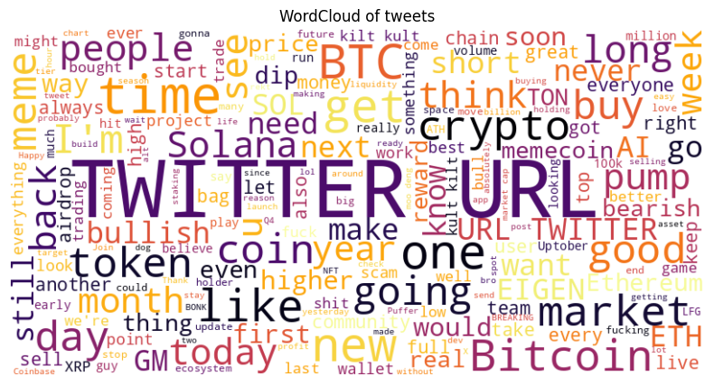

# Detailed Report on this project

## Key Insights from EDA and Cleaning  

## Data Characteristics
The dataset contains 2,224 records with 7 features:  
- `id`  
- `text`  
- `label`  
- `timestamp`  
- `account_id`  
- `is_crypto_tweet`  
- `text_len`  

**Sentiment Distribution**

The dataset includes three sentiment labels related to the cryptocurrency market:  

| Label   | Sentiment | Count |  
|---------|------------|--------|  
| 1       | Neutral   | 1,133  |  
| 2       | Bullish   | 734    |  
| 0       | Bearish   | 357    |  

Overall, the dataset is **imbalanced**, with neutral tweets being the most common and bearish tweets the least.  

**Feature Selection**

- **Text length**: Expected to be captured by the model, so it was not used as a separate feature.  
- **Timestamp**: Useful for time-series analysis but was not included in this project.  
- **is_crypto_tweet**: Largely missing (98% of records), so it was dropped.  
- **Final features used**: Only `text` and `label`.  

**Tweet Length Analysis**

- **Character limits**: Free accounts can post up to **280 characters**, while Premium users can post up to **25,000 characters**.  
- **Findings**: Only **92 tweets** exceeded the free account limit.  

Text Length per Sentiment Label

| Label | Count  | Mean Length | Std Dev | Min | 25% | 50% | 75% | Max |  
|-------|--------|-------------|--------|-----|----|----|----|-----|  
| 0 (Bearish) | 357  | 99.24  | 89.39  | 2   | 41  | 71  | 133  | 883  |  
| 1 (Neutral) | 1,133 | 86.75  | 117.88 | 2   | 23  | 52  | 117  | 1,699 |  
| 2 (Bullish) | 734  | 124.53 | 224.48 | 2   | 32  | 75  | 155  | 3,655 |  

Text length frequency:

Text length frequency of tweets with less than 500 characters:

**Handling Emojis**

Since emojis play a crucial role in crypto sentiment (e.g., 🔥, 🚀, 📈), they were **preserved** in the dataset.  

- **42 records** contained only **one emoji** as the full text.  
- In **70 records** with just two characters (Two Enlish alphabet or one emoji), label distribution was:  

| Label | Count |  
|-------|------|  
| 1 (Neutral) | 61 |  
| 2 (Bullish) | 9 |  
| 0 (Bearish) | 1 |  

## Cleaning  

Usual text-cleaning steps (e.g., **removing stopwords**) were not applied, as they could alter sentiment interpretation. Additionally, since a transformer-based model was used, stopword removal was unnecessary.  

**Cleaning steps applied:**  
1. **URL Replacement**: URLs, commonly used in tweets, were replaced with a `TWITTER URL` or `URL`.  
2. **Character Refinement**: Unusual characters were normalized without removing emojis.  (e.g. `𝘵 > t`,
`í > i`,
`À > A`,
`😊 > 😊`)
3. **Whitespace Removal**: Extra spaces were removed.  

After cleaning, **word clouds** were generated for both the training set and the ETH-data set:  

Train WordCloud:

  

Eth WordCloud:

  

## Augmentation  

Class imbalance can bias the model toward the majority class, leading to **skewed predictions**. To address this, **GPT-4o-mini** was used for **paraphrasing-based augmentation**:  

- **Neutral class (1):** No augmentation (already the majority).  
- **Bullish class (2):** Selected samples were paraphrased to increase diversity.  
- **Bearish class (0):** Each sample was paraphrased **twice** to improve representation.  

**Data leakage prevention**: Augmentation was applied only to the training set (after dataset splitting).  

### Post-Augmentation Dataset Balance  

| Label | Count |  
|-------|------|  
| 1 (Neutral) | 805 |  
| 2 (Bullish) | 805 |  
| 0 (Bearish) | 747 |  

After augmentation, the dataset became **well-balanced**, improving the model’s ability to learn from all sentiment classes effectively.  

## Challenges Encountered and Mitigation Strategies  

### Challenge 1: Crypto Slang and Sarcasm  
- Crypto discussions often include non-standard language, memes, and sarcasm, making sentiment analysis more difficult.  
- **Solution:** Leveraged a domain-specific fine-tuned BERT model trained on crypto tweets to enhance contextual understanding.  

### Challenge 2: Proper Tokenizer  
- The dataset contains Chinese, Korean, and Japanese characters, highlighting their importance in sentiment analysis.  
- **Solution:** Used a multilingual tokenizer and model to ensure all relevant information is properly recognized.  

### Challenge 3: Imbalanced Data  
- The dataset had significantly fewer **bearish** tweets compared to other labels.  
- **Solutions:**  
  1. **Applied data augmentation (paraphrasing)** to increase diversity in the bearish class.  
  2. **Changed the loss function** to improve model performance on underrepresented classes (e.g., Weighted Cross-Entropy Loss, Focal Loss, Dice Los).  
  3. **Used unbiased evaluation metrics** that account for class imbalance, such as Precision, Recall, F1, and AUC-ROC.  

### Challenge 4: Mentioning Coin Prices  
- A tweet like **"I bought ETH at 2000"** does not directly indicate if the price is increasing or decreasing.  
- **Solution:**  (not included in this project)
  - A **time-series model** with historical price data would be necessary.  
  - Another approach could involve **function calling** to fetch real-time coin prices and integrate **Agentic AI** for deeper analysis.  

### Challenge 5: Mixed Sentiments in a Single Tweet  
- Example: **"ETH is pumping 🚀 but BTC is dead 💀"** expresses **both bullish and bearish sentiments**.  
- **Solution:** Implemented **Aspect-Based Sentiment Analysis (ABSA)** to handle multiple sentiments in a single tweet.  
- **ABSA Approaches:**  
  1. **Transformer-Based Models** (not covered in this project):  
     One model tags aspects (coins mentioned), and a second model determines their sentiment.  
  2. **LLM with Structured Output** (implemented):  
     A single **GPT-4o-mini** API call extracts aspects and determines their sentiment in one step.  

### Challenge 6: Lack of a Dedicated Dataset for ABSA  
- No existing benchmark dataset for **coin-based sentiment analysis** was available.  
- **Solution:**  
  - The column `detected_symbols` in Eth dataset, allowing partial evaluation of aspect extraction.  
  - A **dedicated test set** for aspect-based sentiment evaluation should be created in the future.  

### Challenge 7: Limitations of Open-Source LLMs for Structured Output  
- Some **open-source LLMs** struggle with **structured outputs**, limiting their usability.  
- **Solutions:**  
  1. Identify and test better-performing open-source models for local deployment.  
  2. Use cheaper proprietary models, such as **GPT-4o-mini**, for structured tasks.  

### Challenge 8: Extracted Coin Names
- Coins can be referenced by their full name (e.g., Ethereum) or abbreviation (e.g., ETH), leading to inconsistencies in extraction.
- **Solution:** Implemented a post-processing phase to normalize coin names, ensuring consistency across different mentions. This involved mapping abbreviations to their full names and vice versa where necessary.

### Challenge 9: Defining a Sentiment Index  
- The dataset does not include a **sentiment index column**, requiring a method to define one.  
- **Possible Formulas:**  
  1. **(Probability of Bullish) - (Probability of Bearish)**  
  2. **Probability of the predicted label** (e.g., bearish sentiment weighted as `-1`)  

## Improving Model Accuracy  

### Feature Selection
- **Adding real-time price data** to update sentiment labels based on market trends.  
- **Using tweet metadata** like author influence and engagement metrics (likes, retweets) to improve sentiment prediction.  

### Better Tokenization & Preprocessing  
- **Fixing tokenization** to handle emojis, hashtags, and abbreviations correctly.  
- **Cleaning data more carefully** to keep important details and remove unnecessary text.  

### Handling Unclear Sentiment  
- **Using multi-task learning** to help the model understand difficult cases.  for example Training on sarcasm and irony by adding tweets with clear labels to teach the model to recognize them.

### Training on More Crypto-Specific Data  
- **Fine-tuning the model** on crypto-related tweets to improve its understanding of the language used in this area.  
- **Optimizing model settings** to improve performance.  
Training with Unlabeled Data  
- Using Semi-Supervised Learning When manual labeling takes too much time or is expensive,

### Implementing Contrastive Learning for Better Representations  
- **Applying contrastive learning techniques** to enhance the model’s ability to distinguish between subtle variations in sentiment expressions, leading to more accurate predictions.  

### Ensembling Models for Robustness
- **Using different models together** to get better predictions:  
  - **Rule-based + CryptoBERT** for structured sentiment scoring.  
  - **Lexicon-based + Transformer-based model** for a mix of simple rules and deep learning.  
  - **Voting method** between different transformer models (**RoBERTa, BERTweet, DeBERTa**) to balance their strengths.

## Challenging Tweets
- Tweets with images, memes, and GIFs cannot be properly analyzed using text-only models; multimodal models are required for these types of content.

- For tweets mentioning multiple coins, the sentiment index is unreliable for either of them. The ABSA approach used in this project doesn't provide a sentiment probability, making it unsuitable for further numerical analysis.

- Ambiguous sentiment, such as sarcasm or irony, still poses a challenge in tweet analysis.

## Relationships and Trends Between Sentiment Index and ETH Prices

Etherium Sentiment Index Chart:

Etherium Sentiment vs. Price Chart (Time Series): 

### Analysis Report on Sentiment Index and ETH Price Correlations

Sentiment Index Close Price Correlation:
- Pearson: 0.2283 (p-value: 0.2250)
- Spearman: 0.2845 (p-value: 0.1275)

Sentiment Index Open Price Correlation:
- Pearson: 0.0823 (p-value: 0.6655)
- Spearman: 0.1573 (p-value: 0.4065)

Sentiment Index Percentage Change in Close Price (Day-to-Day):
- Pearson: 0.2689 (p-value: 0.1583)
- Spearman: 0.3094 (p-value: 0.1025)

Sentiment Index Percentage Change Between Open and Close Price:
- Pearson: 0.2820 (p-value: 0.1311)
- Spearman: 0.3313 (p-value: 0.0738)

**Conclusion on correlations:** The analysis indicates weak and statistically insignificant correlations between sentiment index and various ETH price metrics, including close price, open price, day-to-day changes, and intraday price shifts. While sentiment shows some potential to explain minor variations in ETH's price movements, further investigation and more refined models (e.g., incorporating additional features like trading volume or lagged sentiment) are required to draw more meaningful conclusions.

### Considering Points

While the correlations observed do not show a strong relationship between the sentiment index and Ethereum's closing price, there are several key factors that need to be considered for a more comprehensive understanding:

- Bullish Market Conditions: We are currently in a predominantly bullish market, where most price candles are green, and the sentiment in tweets is largely positive. However, market sentiment can shift rapidly, and we may enter a bearish phase in the coming months. If this happens, the volume of negative tweets will likely increase, which could significantly alter the correlation dynamics. This transition needs to be accounted for, as it may have a considerable impact on the sentiment-price relationship.

- Time Frame: The analysis is based on 30 days, which may not be sufficient to capture the full complexity of the crypto market. Cryptocurrency markets are highly volatile, and they experience fluctuations over short, mid, and long-term periods. 30 days might not fully reflect these varying time horizons, so expanding the dataset to cover a longer period would allow for a deeper and more accurate analysis of sentiment's effect on price movement.

- Model Deployment: Deploying the model is only the first step in a much larger process. To gain more meaningful insights, thorough backtesting is essential. This will help us understand how the model performs across different market conditions and over time. Backtesting also allows us to assess whether the model can accurately generate signals for short, mid, or long-term trading strategies, ensuring that the sentiment data is used effectively.

- Tweet Frequency: While an increase in tweet frequency is important and indicates market excitement, it is crucial to note that this spike often reflects emotions toward price changes rather than acting as a signal for those changes. In other words, the sentiment is typically a result of price movements, not a predictor of them. Therefore, while frequent tweets may indicate heightened market activity, they should not be viewed as an independent signal of future price shifts.

## Tradeoffs for a 5-Second Per-Tweet Prediction Limit  

Given the constraint of processing **20k tweets per day** with a **maximum latency of 5 seconds per tweet**, several tradeoffs must be considered:  

### Tradeoff 1: Model Complexity vs. Speed  
- **Lightweight transformer models** (e.g., DistilBERT) improve speed but may sacrifice accuracy.  
- **Alternative:** Use a **two-stage approach**—a smaller model for quick classification and a larger model for reprocessing high-impact tweets.  
- **Another solution:** Implement **quantized models** or leverage optimized inference engines like **ONNX** for efficiency.  

### Tradeoff 2: Batch Processing vs. Real-Time Predictions  
- **Batch inference** improves GPU utilization but introduces slight delays.  
- **Solution:** Use a **hybrid approach**—real-time inference for trending tweets and batch processing for bulk data.  
- **Another solution:** Buffer incoming tweets and **run batch inference every 5 minutes** for improved efficiency.  

### Tradeoff 3: Token Limitations vs. Sentiment Depth  
- **Short tweets** can be processed quickly, but longer tweets require truncation or summarization.  
- **Solution:** Applied **adaptive truncation strategies** to retain the most sentiment-relevant parts of each tweet.  

### Tradeoff 4: GPU vs. CPU Inference  
- **GPU inference** is significantly faster than CPU but comes with higher costs.  
- **Using GPUs** is especially efficient for bulk analysis due to their parallel processing capabilities.  
- **Solution:** Consider **cloud deployment with autoscaling** to optimize GPU usage during high-traffic periods while keeping costs manageable.

## Recommendations for Real-World Market Analysis
The sentiment analysis model provides valuable insights for crypto traders, investors, and analysts. Here’s how it can be applied in real market situations:

**1. Early Detection of Market Trends**:

By tracking changes in sentiment, traders can identify bullish or bearish trends before major price shifts.
*Example: A sudden rise in bullish sentiment on Crypto Twitter could signal increased buying pressure.*

**2. Sentiment-Based Trading Signals**

The sentiment index can complement algorithmic trading strategies alongside technical indicators.
*Example:*
- *Buy signal: Strongly bullish sentiment with price consolidation.*
- *Sell signal: Sentiment drops sharply, even as the price rises.*

**3. Risk Management & Market Sentiment Alerts**

Extreme sentiment levels can indicate potential bubbles or crashes.
*Example: A high bullish sentiment score combined with excessive leverage may signal a market correction.*

**4. Anomaly & Manipulation Detection**
Spot unusual sentiment spikes caused by coordinated social media efforts or pump-and-dump schemes.
*Example: A sudden surge in bullish tweets about a low-cap altcoin could suggest market manipulation.*

**5. Sentiment-Driven Portfolio Management**

Investors can adjust their portfolios based on long-term sentiment trends.
*Example: If Ethereum’s sentiment remains bullish while Bitcoin’s sentiment weakens, portfolio allocations can be shifted accordingly.*

**6. News Impact Assessment**

Track how sentiment shifts before and after major news events.
*Example: If sentiment remains positive after negative news, it may indicate market resilience.*

